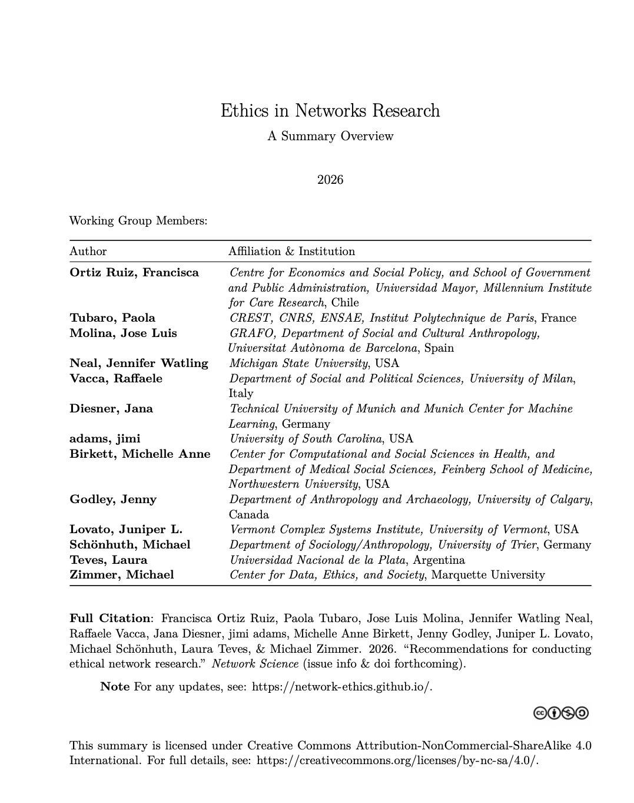
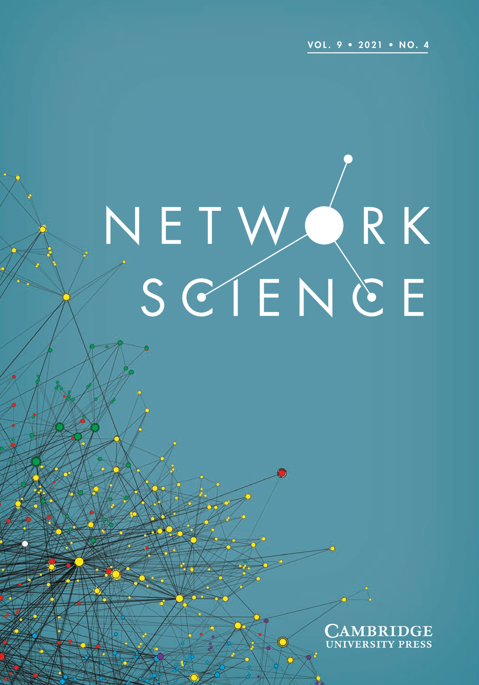

<!-- Maintaining a floating title and navigation banner -->

## Ethics in Networks Research

**[Overview](#overview) | [Recommendations](#main-recommendations) | [Background](#background) | [Contributors](#contributors) | [Endorsements](#endorsements) **

<!-- Add spacing below so the navbar doesn't cover your first header -->

## Overview

This site accompanies the working group's effort to provide a summary of existing guidance for ethically conducting social network research. The primary products of that effort are 2-fold: 

 

  
  

 
- The [**Summary Document**](assets/images/ExecSummary.pdf) is intended as a helpful resource for researchers to share with ethics review committees who are unfamiliar with network methods and therefore may require distilled accounts of the field's current best practices.
- The [**full article**](https://www.cambridge.org/core/journals/network-science) (link forthcoming upon publication) provides the more thorough basis of the recommendations, along with documented elaboration of the literature from which those have been drawn.

In addition to these sharing aims, this site also provides an opportunity for organizations and individuals to [endorse](#endorsements) these recommendations, along with a central location to house those endorsements.

## Main Recommendations
The recommendations largely fall into three primary consideration domains:

- Data Collection: *Consent & Confidentiality*
- Data Use: *Analysis, Presentation, & Visualization*
- Dava Availability: *Storage, Publication, & Sharing*

Here, I think we provide an overview of the domains of the particular recommendations (not sure how much detail we want though vs. just point to the docs?). This section may be the most likely to be triaged, but for the moment, I'm essentially just mimicking the structure of Zak's old [site](https://web.archive.org/web/20251211131845/https://www.zacharyneal.com/datasharing)[^1] just to give myself an initializing framework here.

## Background

I'd like to have a (brief) narrative of this project here (though given what I did to the timeline, I don't want to put the dates in print ;) ).

## Contributors

**Francisca Ortiz Ruiz**, *Universidad Mayor*, Chile  
**Tubaro, Paola**, *Institut Polytechnique de Paris*, France  
**Molina, Jose Luis**, *Universitat Autònoma de Barcelona*, Spain  
**Neal, Jennifer Watling**, *Michigan State University*, USA   
**Vacca, Raffaele**, *University of Milan*, Italy  
**Diesner, Jana**, *Technical University of Munich*, Germany  
**adams, jimi**, *University of South Carolina*, USA  
**Birkett, Michelle Anne**, *Northwestern University*, USA  
**Godley, Jenny**, *University of Calgary*, Canada  
**Lovato, Juniper L.**, *University of Vermont*, USA  
**Schönhuth, Michael**, *University of Trier*, Germany  
**Teves, Laura**, *Universidad Nacional de la Plata*, Argentina  
**Zimmer, Michael**, *Marquette University*, USA

## Endorsements

If you would like to add an endorsement (personal or organizational) to these recommendations, please complete [this form](https://forms.gle/f8mExDiTuVgRhpkf6).
Here's where the endorsements will go as they come in. 

[^1]: It's offline, so that's a pointer to the wayback version.